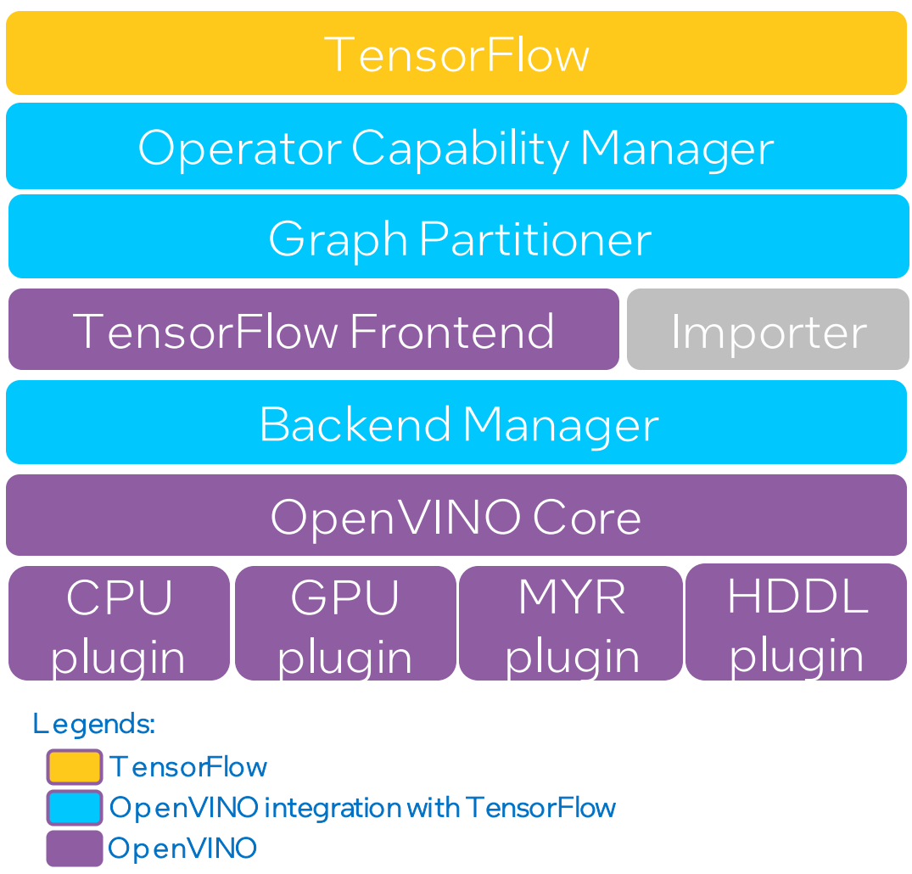

English | <a href="/openvino_tensorflow/docs/I05038-2-ARCHITECTURE_cn.md">简体中文</a>

# Architecture of **OpenVINO™ integration with TensorFlow**

This document describes a high-level architecture of **OpenVINO™ integration with TensorFlow**. This capability is registered as a graph optimization pass in TensorFlow and optimizes the execution of supported operator clusters using OpenVINO™ runtime. Unsupported operators fall back on native TensorFlow runtime.

## Architecture Diagram

The diagram below depicts the high level architecture of **OpenVINO™ integration with TensorFlow**. We broadly categorize this software stack into layered modules as shown below. The purple box at the bottom shows the components of OpenVINO™ including a number of device plugins along with the corresponding libraries.

  

## Description of modules

In this section, we will describe the functionality of each module and how it transforms the original TensorFlow graph.

#### Operator Capability Manager

Operator Capability Manager (OCM) implements several checks on TensorFlow operators to determine if they are supported by OpenVINO™ backends (Intel® hardware). The checks include supported operator types, data types, attribute values, input and output nodes, and many more conditions. The checks are implemented based on the results of several thousands of operator tests and model tests. OCM is continuously evolving as we add more operator tests and model tests to our testing infrastructure. This is an important module that determines which layers in the model should go to OpenVINO™ backends and which layers should fall back on native TensorFlow runtime. OCM takes TensorFlow graph as the input and returns a list of operators that can be marked for clustering so that the operators can be run in OpenVINO™ backends.

#### Graph Partitioner

Graph partitioner examines the nodes that are marked for clustering by OCM and performs a further analysis on them. In this stage, the marked operators are first assigned to clusters. Some clusters are dropped after the analysis. For example, if the cluster size is very small or if the cluster is not supported by the backend after receiving more context, then the clusters are dropped and the operators fall back on native TensorFlow runtime. Each cluster of operators is then encapsulated into a custom operator that is executed in OpenVINO™ runtime.

#### TensorFlow Importer

TensorFlow importer translates the TensorFlow operators in the clusters to OpenVINO™ nGraph operators with the latest available [operator set](https://docs.OpenVINOtoolkit.org/latest/openvino_docs_ops_opset.html) for OpenVINO™ toolkit. An [nGraph function](https://docs.openvinotoolkit.org/latest/openvino_docs_nGraph_DG_build_function.html) is built for each of the clusters. Once created, it is wrapped into an OpenVINO™ CNNNetwork that holds the intermediate representation of the cluster to be executed in OpenVINO™ backend.

#### Backend Manager

Backend manager creates a backend for the execution of the CNNNetwork. We implemented two types of backends:

* Basic backend
* VAD-M backend

Basic backend is used for Intel® CPUs, Intel® integrated GPUs and Intel® Movidius™ Vision Processing Units (VPUs). The backend creates an inference request and runs inference on a given input data.

VAD-M backend is used for Intel® Vision Accelerator Design with 8 Intel® Movidius™ MyriadX VPUs (referred as VAD-M or HDDL). We support batched inference execution in the VAD-M backend. When the user provides a batched input, multiple inference requests are created and inference is run in parallel on all the available VPUs in the VAD-M.

Backend Manager supports Dynamic Fallback which means if the execution of the corresponding CNNNetwork fails in OpenVINO runtime, the execution fallbacks to stock TensorFlow runtime. 