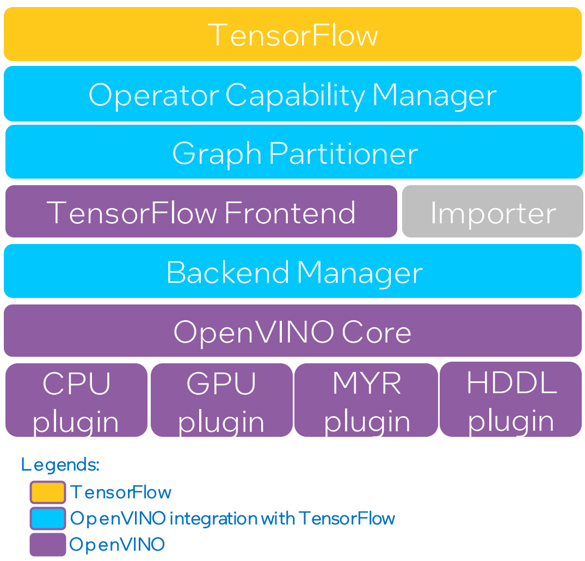

# **OpenVINO™ integration with TensorFlow** 的架构

本文介绍了 **OpenVINO™ integration with TensorFlow** 的高级架构。该功能注册为 TensorFlow 中的graph Optimization Pass，并使用 OpenVINO™ 运行时优化所支持的算子集群的执行。不支持的算子集群返回至原生 TensorFlow 运行时。

## 架构图

下图描述了 **OpenVINO™ integration with TensorFlow** 的高级架构。我们大致将该软件堆栈分成如下几个分层模块。底部紫色方框显示的是 OpenVINO™ 的组件，包括许多设备插件和相应的库。

  

## 模块说明

本节我们介绍每个模块的功能，及其如何转换成原始 TensorFlow 图。

#### Operator Capability Manager

Operator Capability Manager (OCM) 对 TensorFlow 算子实施几项检查，以确定 OpenVINO™ 后端（英特尔® 硬件）是否支持该算子。检查包括支持的算子类型、数据类型、属性值、输入输出节点和其他条件。这些检查的实施基于数千项算子测试和模型测试的结果。随着我们将更多算子测试和模型测试添加到测试基础设施中，OCM 将持续演进和发展。这是一个重要模块，它决定模型中的哪些层前往 OpenVINO™ 后端，哪些层返回 TensorFlow 原生运行时。OCM 将 TensorFlow 图作为输入，返回一个可标记进行集群化的算子列表，以便这些算子在 OpenVINO™ 后端中运行。

#### Graph Partitioner

Graph partitioner 检查 OCM 标记的节点，并对其进行进一步分析。在这一阶段，标记的算子首先分配给集群。一些集群会在分析之后被删除掉。例如，如果集群很小，或者在接收较多上下文后，集群不被后端支持，那么该集群将被删除，算子返回原生 TensorFlow 运行时。之后，每个算子集群都被封装到自定义算子中，在 OpenVINO™ 运行时中执行。

#### TensorFlow Importer

TensorFlow importer 通过用于 OpenVINO™ 工具套件的最新[算子集](https://docs.OpenVINOtoolkit.org/latest/openvino_docs_ops_opset.html)将集群中的 TensorFlow 算子解析为 OpenVINO™ nGraph 算子。[nGraph 函数](https://docs.openvinotoolkit.org/latest/openvino_docs_nGraph_DG_build_function.html)专门用于各个集群。该函数创建后，将被封装到 OpenVINO™ CNNNetwork 中，该网络包含将在 OpenVINO™ 后端执行的集群的中间表示。

#### Backend Manager

Backend manager 创建一个后端，用于执行 CNNNetwork。我们实施了两类后端。

* 基础 后端
* VAD-M 后端

基础 后端用于英特尔® CPU、英特尔® 集成 GPU 和英特尔® Movidius™ 视觉处理单元 (VPU)。后端创建推理请求并在对指定的输入数据运行推理。

VAD-M 后端用于支持 8 颗英特尔 Movidius™ MyriadX VPU 的英特尔® 视觉加速器设计（称作 VAD-M 或 HDDL）。我们支持在 VAD-M 后端执行批量推理。用户提供批量输入后，将会创建多个推理请求，且推理在 VAD-M 中所有的可用 VPU 中并行运行。