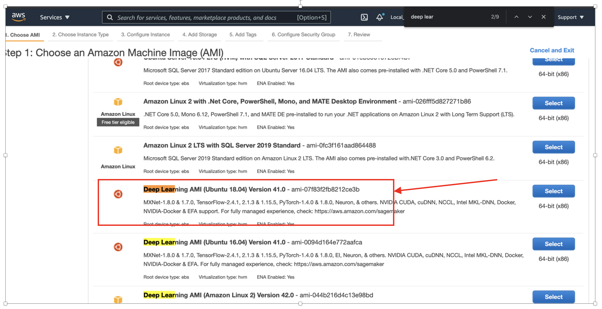
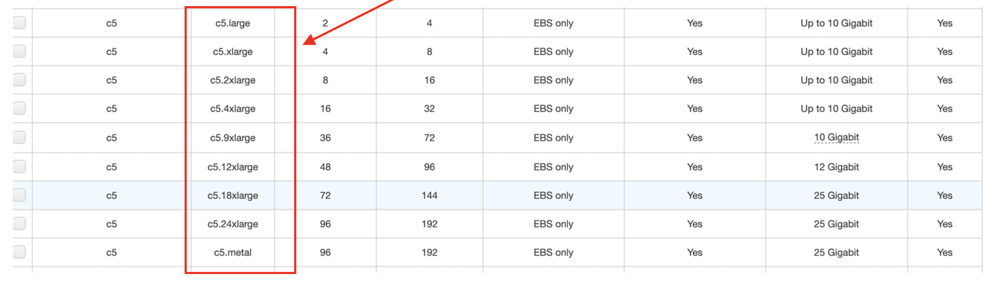
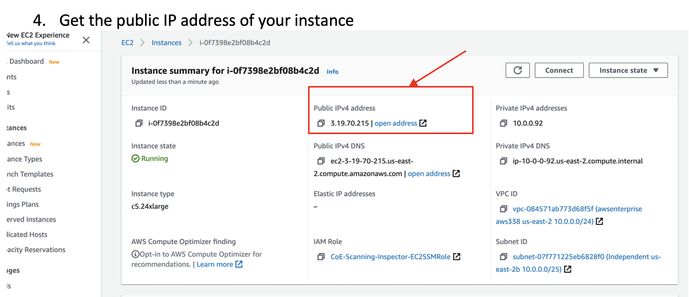

# Instructions to accelerate TensorFlow models on AWS with the **OpenVINO™ integration with TensorFlow**

-	Launch the Deep Learning AMI EC2 instance Ubuntu 18.04 Version 41.0

<p align="center">
 
</p>

-	Choose one of the C5 instances –these are optimized for inference. The larger the instance,the faster the inference

<p align="center">

 </p>

-	Then download the *.pem files for keys on your laptop. 
chmod 400 the *.pem key.  

-	Get the public IP address of your instance 

<p align="center">

</p>

-	Wait for the instance to finish initializing and be fully running and functional
- 
  ```bash
  $ ssh -i *.pem <IP-addr-of-your-instance>  
  $ scp -i *.pem  <source-file> <IP-addr-of-your-instance>:/tmp
  ```

  SSH and SCP with the AWS instance should be working (Note: It worked seamlessly on our team Intel provided AWS account, but developers might need to configure networking to enable this). 
  
- Install **OpenVINO™ integration with TensorFlow**

```bash

  ubuntu@ip-10-0-0-123:~$python3 -m venv myenv
  
  ubuntu@ip-10-0-0-123:~$ source myenv/bin/activate

  (myenv) ubuntu@ip-10-0-0-123:~$ pip install --upgrade pip

  (myenv) ubuntu@ip-10-0-0-123:~$ pip install -U tensorflow==2.5.0

  (myenv) ubuntu@ip-10-0-0-123:~$ pip install -U openvino-tensorflow
  
```
-	verify the installation 

```bash
(myenv) ubuntu@ip-10-0-0-123:~$ python3 -c "import tensorflow as tf; print('TensorFlow version: ',tf.__version__); import openvino_tensorflow; print(openvino_tensorflow.__version__)"

TensorFlow version:  2.5.0
OpenVINO integration with TensorFlow version: b'0.5.0'
OpenVINO version used for this build: b'2021.4'
TensorFlow version used for this build: v2.5.0
CXX11_ABI flag used for this build: 0
```

- Clone the repo to run the example
```bash
$ git clone --recursive https://github.com/openvinotoolkit/openvino_tensorflow.git
```

Or just download the entire gitrepo as a zip/tar file to your local directory and scp it to the AWS instance (you might need to scp to :/tmp for permission reasons, and then ssh to the instance then copy the zip to your home directory)

```bash
(myenv) ubuntu@ip-10-0-0-123:~$ cd openvino_tensorflow/

(myenv) ubuntu@ip-10-0-0-123:~/openvino_tensorflow $ curl -L "https://storage.googleapis.com/download.tensorflow.org/models/inception_v3_2016_08_28_frozen.pb.tar.gz" | tar -C ./examples/data -xz

% Total    % Received % Xferd  Average Speed   Time    Time     Time  Current
                                 Dload  Upload   Total   Spent    Left  Speed
100 84.5M  100 84.5M    0     0  41.4M      0  0:00:02  0:00:02 --:--:-- 41.4M

(myenv) ubuntu@ip-10-0-0-123:~/openvino_tensorflow $ python3 examples/classification_sample.py

2021-05-07 06:40:14.806432: I tensorflow/stream_executor/platform/default/dso_loader.cc:49] Successfully opened dynamic library libcudart.so.11.0
Available Backends:
CPU
2021-05-07 06:40:16.372528: I tensorflow/core/platform/cpu_feature_guard.cc:142] This TensorFlow binary is optimized with oneAPI Deep Neural Network Library (oneDNN) to use the following CPU instructions in performance-critical operations: AVX2 AVX512F FMA
To enable them in other operations, rebuild TensorFlow with the appropriate compiler flags.
2021-05-07 06:40:16.372761: I tensorflow/compiler/jit/xla_gpu_device.cc:99] Not creating XLA devices, tf_xla_enable_xla_devices not set
2021-05-07 06:40:16.373651: I tensorflow/stream_executor/platform/default/dso_loader.cc:49] Successfully opened dynamic library libcuda.so.1
2021-05-07 06:40:16.439999: E tensorflow/stream_executor/cuda/cuda_driver.cc:328] failed call to cuInit: CUDA_ERROR_NO_DEVICE: no CUDA-capable device is detected
2021-05-07 06:40:16.440050: I tensorflow/stream_executor/cuda/cuda_diagnostics.cc:156] kernel driver does not appear to be running on this host (ip-172-31-47-195): /proc/driver/nvidia/version does not exist
2021-05-07 06:40:16.446908: I tensorflow/compiler/jit/xla_cpu_device.cc:41] Not creating XLA devices, tf_xla_enable_xla_devices not set
2021-05-07 06:40:16.447236: I tensorflow/compiler/jit/xla_gpu_device.cc:99] Not creating XLA devices, tf_xla_enable_xla_devices not set
2021-05-07 06:40:16.461838: I tensorflow/compiler/mlir/mlir_graph_optimization_pass.cc:196] None of the MLIR optimization passes are enabled (registered 0 passes)
2021-05-07 06:40:16.473450: I tensorflow/core/platform/profile_utils/cpu_utils.cc:112] CPU Frequency: 2999995000 Hz
Inference time in ms: 44.924974
military uniform 0.83430535
mortarboard 0.021869535
academic gown 0.010358114
pickelhaube 0.008008192
bulletproof vest 0.0053509413 
```
