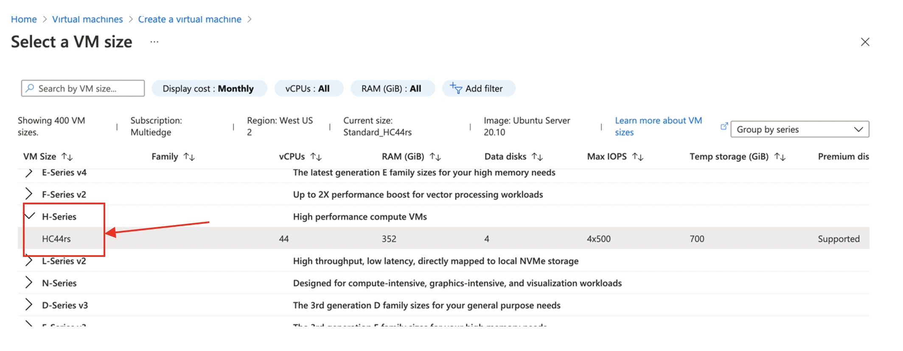
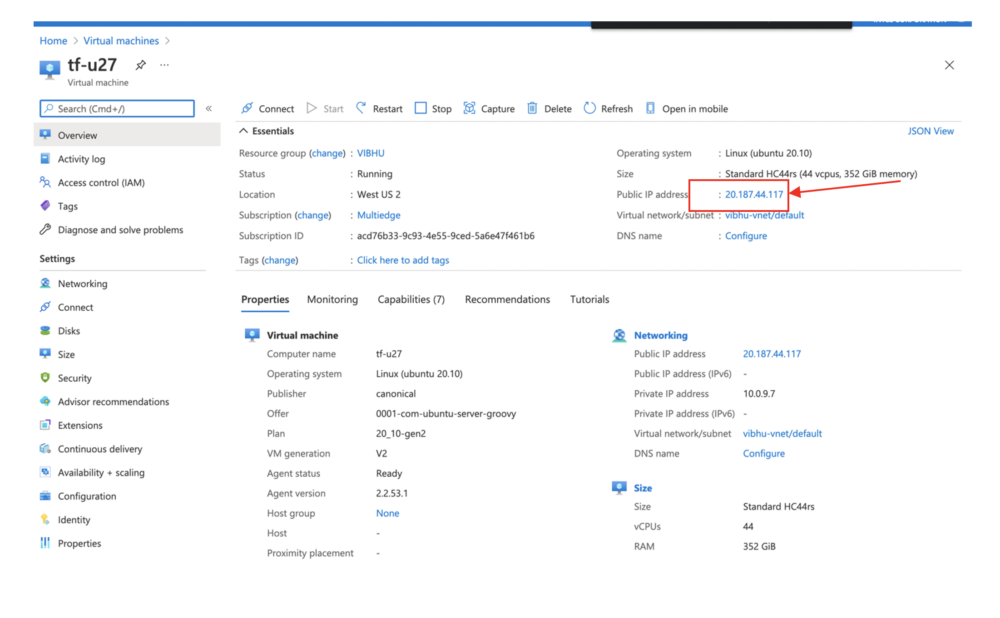

[English](./Azure_instructions.md) | 简体中文

# 使用 **OpenVINO™ integration with TensorFlow** 在 Azure 上加速 TensorFlow 模型的指令

-	创建虚拟机 – 选择 Ubuntu Server 20.10 – Gen2 镜像

<p align="center">
 
</p>

-	选择一个像 HC44rs 这样的实例。 实例越大，性能越高 

<p align="center">

 </p>

-	然后在您的笔记本电脑上下载密钥的 *.pem 文件。 
chmod 400 the *.pem key.  

-	获取实例的公网IP地址 

<p align="center">

</p>

-	使用 SSH 登录到 Azure 实例  
  ```bash
  $ ssh -i *.pem <IP-addr-of-your-instance>  
  $ scp -i *.pem  <source-file> <IP-addr-of-your-instance>:/tmp
  ```

  SSH 和 SCP 与 Azure 实例应该可以正常工作（注意：请确保正确配置网络以启用对所选 VM 实例的 SSH 和 SCP 访问。）
  ```bash
  azureuser@tf-u27:~$ python3 --version
  Python 3.8.6
  ```
- 安装 **OpenVINO™ integration with TensorFlow**
```bash
$ sudo apt-get update

$ sudo apt install python3-pip 

$ sudo pip3 install tensorflow==2.8.0

$ sudo pip3 install openvino-tensorflow==2.0.0
```

- 验证安装
```bash
azureuser@tf-u26:~$ python3 -c "import tensorflow as tf; print('TensorFlow version: ',tf.__version__); import openvino_tensorflow; print(openvino_tensorflow.__version__)" 
TensorFlow version:  2.8.0
OpenVINO integration with TensorFlow version: b'2.0.0'
OpenVINO version used for this build: b'2022.1'
TensorFlow version used for this build: v2.8.0
CXX11_ABI flag used for this build: 0
```


- 克隆 repo 以运行示例
```bash
$ git clone --recursive https://github.com/openvinotoolkit/openvino_tensorflow.git
```

或者只是将整个 gitrepo 作为 zip/tar 文件下载到您的本地目录，然后将其 scp 到 azure 实例，然后将其解压缩到您的主目录中。
您可能需要安装unzip解包工具以解压repo的内容
```bash
$ sudo apt install unzip  
```
```bash
azureuser@tf-u26:~$ ls
openvino_tensorflow-master  openvino_tensorflow-master.zip

azureuser@tf-u26:~$ cd openvino_tensorflow-master/

azureuser@tf-u27:~/openvino_tensorflow-master$ curl -L "https://storage.googleapis.com/download.tensorflow.org/models/inception_v3_2016_08_28_frozen.pb.tar.gz" | tar -C ./examples/data -xz

  % Total    % Received % Xferd  Average Speed   Time    Time     Time  Current
                                 Dload  Upload   Total   Spent    Left  Speed
100 84.5M  100 84.5M    0     0  41.4M      0  0:00:02  0:00:02 --:--:-- 41.4M

azureuser@tf-u27:~/openvino_tensorflow-master$ python3 examples/classification_sample.py 

2021-03-16 18:49:47.205522: W tensorflow/stream_executor/platform/default/dso_loader.cc:55] Could not load dynamic library 'libcuda.so.1'; dlerror: libcuda.so.1: cannot open shared object file: No such file or directory

2021-03-16 18:49:47.205553: E tensorflow/stream_executor/cuda/cuda_driver.cc:313] failed call to cuInit: UNKNOWN ERROR (303)

2021-03-16 18:49:47.205574: I tensorflow/stream_executor/cuda/cuda_diagnostics.cc:156] kernel driver does not appear to be running on this host (tf-u27): /proc/driver/nvidia/version does not exist

2021-03-16 18:49:47.205753: I tensorflow/core/platform/cpu_feature_guard.cc:143] Your CPU supports instructions that this TensorFlow binary was not compiled to use: AVX2 AVX512F FMA

2021-03-16 18:49:47.214779: I tensorflow/core/platform/profile_utils/cpu_utils.cc:102] CPU Frequency: 2693670000 Hz

2021-03-16 18:49:47.219130: I tensorflow/compiler/xla/service/service.cc:168] XLA service 0x7f881c000b60 initialized for platform Host (this does not guarantee that XLA will be used). Devices:

2021-03-16 18:49:47.219153: I tensorflow/compiler/xla/service/service.cc:176]   StreamExecutor device (0): Host, Default Version

可用后端：
CPU  
Inference time in ms: 8.149624  
military uniform 0.8343049  
mortarboard 0.021869553  
academic gown 0.010358133  
pickelhaube 0.008008199  
bulletproof vest 0.0053509558  
```
