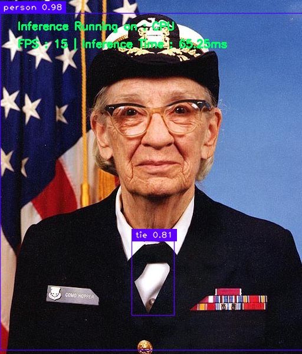

<p>English | <a href="https://github.com/openvino_tensorflow/examples/README_cn.md">简体中文</a></p>


# Intel<sup>®</sup> OpenVINO<sup>TM</sup> integration with TensorFlow - C++ and Python Examples

These examples demonstrate how to use **Intel<sup>®</sup> </sup> OpenVINO<sup>TM</sup> integration with Tensorflow** to recognize and detect objects in images and videos.

## Demos showcased in the examples

* Classification demo uses Google's Inception v3 model to classify a given image, video, directory of images and camera input.
* Object detection demo uses YOLOv3 darknet model to detect objects in a given image, video, directory of images and camera input.

## Setup for the examples

Before you proceed to run the examples, you will have to clone the `openvino_tensorflow` repository to your local machine. For this, run the following commands:

```bash
$ git clone https://github.com/openvinotoolkit/openvino_tensorflow.git
$ cd openvino_tensorflow
$ git submodule init
$ git submodule update --recursive
```

## Python implementation for classification

For this example, we assume that you've already:

* Installed TensorFlow on your system
* Installed **Intel<sup>®</sup> </sup> OpenVINO<sup>TM</sup> integration with Tensorflow** on your system

Refer to [**this page**](https://github.com/openvinotoolkit/openvino_tensorflow#installation) for a quick install with pip.

The TensorFlow model used in this demo is not packaged in the repo because of its size. So, download the model to the `data` directory in your `cloned repo of openvino_tensorflow` and extract the file:

```bash
$ curl -L "https://storage.googleapis.com/download.tensorflow.org/models/inception_v3_2016_08_28_frozen.pb.tar.gz" |
  tar -C <path-to-openvino_tensorflow-repository>/examples/data -xz
```

Once extracted, the data folder will contain two new files:

* imagenet_slim_labels.txt
* inception_v3_2016_08_28_frozen.pb

Open `imagenet_slim_labels.txt` to read the labels in the data directory for the possible classifications. In the .txt file, you'll find 1,000 categories that were used in the Imagenet competition.

Install the pre-requisites
```bash
$ cd <path-to-openvino_tensorflow-repository>/examples
$ pip3 install -r requirements.txt
```
Now, you can run classification sample using the instructions below:


```bash
$ cd <path-to-openvino_tensorflow-repository>
$ python3 examples/classification_sample.py
```

`classification_sample.py` does inference on the default example image that comes with this repository and should output something similar to:

```
military uniform (653): 0.834306
mortarboard (668): 0.0218693
academic gown (401): 0.010358
pickelhaube (716): 0.00800814
bulletproof vest (466): 0.00535091
```

In this case, we are using the default image of Admiral Grace Hopper. As you can see, the network correctly spots that she's wearing a military uniform, with a high score of 0.8.

Next, try it out by passing the --input=argument, where argument is the path to your new input. You can provide either absolute or relative path to an image or video or directory of images.
e.g.
```bash
$ python3 examples/classification_sample.py --input=<absolute-or-relative-path-to-your-input>
```
If you add the new image (e.g, my_image.png) to the existing data directory in the openvino_tensorflow repository, it will look like this:

```bash
$ python3 examples/classification_sample.py --input=examples/data/my_image.png
```


To see more options for various backends (Intel<sup>®</sup> hardware), invoke:
```bash
$ python3 examples/classification_sample.py --help
```

Next, try it out on your own video file by passing the --input=argument, where argument is the path to your input video. You can provide either absolute or relative path in the argument  e.g.

```bash
$ python3 examples/classification_sample.py --input=<absolute-or-relative-path-to-your-video-file>
```
If you add the new video (e.g, examples/data/people-detection.mp4) to the existing data directory in the openvino_tensorflow repository, it will look like this:

```bash
$ python3 examples/classification_sample.py --input=examples/data/people-detection.mp4
```


## Python implementation for object detection

For this example, we assume that you've already:

* Installed TensorFlow on your system (TF2.x)
* Installed **Intel<sup>®</sup> </sup> OpenVINO<sup>TM</sup> integration with Tensorflow** on your system

[**click-here**](https://github.com/openvinotoolkit/openvino_tensorflow/examples/TF_1_x/README.md) For the conversion of yolov3 darknet model using Tensorflow 1.15 and it's python object detection sample.

Refer to [**this page**](https://github.com/openvinotoolkit/openvino_tensorflow#installation) for a quick install with pip.

Install the pre-requisites
```bash
$ cd <path-to-openvino_tensorflow-repository>/examples
$ pip3 install -r requirements.txt
```

The TensorFlow Yolo v3 darknet model used in this demo is not packaged in the repository because of its size. So, follow the instructions below to convert the model from DarkNet to TensorFlow and download the labels and weights to the `data` directory in your `cloned repo of openvino_tensorflow`:


```bash
$ cd <path-to-openvino_tensorflow-repository>/examples
$ chmod +x convert_yolov3.sh
$ ./convert_yolov3.sh
```

Once completed, the data folder will contain following files needed to run the object detection example:

* coco.names
* yolo_v3_darknet_2.pb

Run the object detection example using the instructions below:

```bash
$ cd <path-to-openvino_tensorflow-repository>
$ python3 examples/object_detection_sample.py
```

This uses the default example image that comes with this repository, and should
output something similar as below:

<p align="left">
  

In this case, we're using the default image of Admiral Grace Hopper. As you can see, the network detects and draws the bounding box around the person correctly.

Next, try it out on your own image by passing the --input=argument, where argument is the path to your new input. You can provide either absolute or relative path in the argument e.g.

```bash
$ python3 examples/object_detection_sample.py --input=<absolute-or-relative-path-to-your-image>
```

If you add the new image (e.g, my_image.png) to the existing data directory in the openvino_tensorflow repository, it will look like this:

```bash
$ cd <path-to-openvino_tensorflow-repository>
$ python3 examples/object_detection_sample.py --input=examples/data/my_image.png
```

To see more options for various backends (Intel<sup>®</sup> hardware), invoke:
```bash
$ python3 examples/object_detection_sample.py --help
```

Next, try it out on your own video file by passing the --input=argument, where argument is the path to your input video. You can provide either absolute or relative path in the argument  e.g.

```bash
$ python3 examples/object_detection_sample.py --input=<absolute-or-relative-path-to-your-video-file>
```
If you add the new video (e.g, examples/data/people-detection.mp4) to the existing data directory in the openvino_tensorflow repository, it will look like this:

```bash
$ python3 examples/object_detection_sample.py --input=examples/data/people-detection.mp4
```

```
## C++ Implementation for classification

For running C++ examples, we need to build TensorFlow framework from source since examples have a dependency on the TensorFlow libraries.

Before you start building from source, you have to make sure that you installed the following dependencies:

* Python 3.6, 3.7, or 3.8
* GCC 7.5 (Ubuntu 18.04)
* Cmake 3.14 or higher
* [Bazelisk v1.7.5](https://github.com/bazelbuild/bazelisk/tree/v1.7.5)
* Virtualenv 16.0.0 or higher
* Patchelf 0.9

The TensorFlow model used in this demo is not packaged in the repo because of its size. So, download the model to the `data` directory in your `cloned repo of openvino_tensorflow` and extract the file:

```bash
$ curl -L "https://storage.googleapis.com/download.tensorflow.org/models/inception_v3_2016_08_28_frozen.pb.tar.gz" |
  tar -C <path-to-openvino_tensorflow-repository>/examples/data -xz
```

Run the following commands to build openvino_tensorflow with samples:

```bash
$ cd <path-to-openvino_tensorflow-repository>
$ python3 build_tf.py --output_dir <path-to-tensorflow-dir>
$ python3 build_ovtf.py --use_tensorflow_from_location <path-to-tensorflow-dir>
```
For detailed build instructions read [**BUILD.md**](https://github.com/openvinotoolkit/openvino_tensorflow/blob/master/docs/BUILD.md#build-from-source).

Now, a binary executable for classification_sample is built. Update the LD_LIBRARY_PATH and run the sample:

```bash
$ export LD_LIBRARY_PATH=$LD_LIBRARY_PATH:<path-to-openvino_tensorflow-repository>/build_cmake/artifacts/lib:<path-to-openvino_tensorflow-repository>/build_cmake/artifacts/tensorflow
$ ./build_cmake/examples/classification_sample/infer_image
```

This uses the default example image that comes with this repository, and should
output something similar to:

```
military uniform (653): 0.834306
mortarboard (668): 0.0218693
academic gown (401): 0.010358
pickelhaube (716): 0.00800814
bulletproof vest (466): 0.00535091
```

In this case, we're using the default image of Admiral Grace Hopper. As you can
see the network correctly spots she's wearing a military uniform, with a high
score of 0.8.

Next, try it out on your own image by passing the --image= argument,  where argument is the path to your new input. You can provide either absolute or relative path in the argument  e.g.


```bash
$ ./build_cmake/examples/classification_sample/infer_image --image=<absolute-or-relative-path-to-your-image>
```

If you add the new image (e.g, my_image.png) to the existing data directory in the openvino_tensorflow repository, it will look like this:

```bash
$ ./build_cmake/examples/classification_sample/infer_image --image=examples/data/my_image.png
```

To see more options for various backends (Intel<sup>®</sup> hardware), invoke:
```bash
$ ./build_cmake/examples/classification_sample/infer_image --help
```
