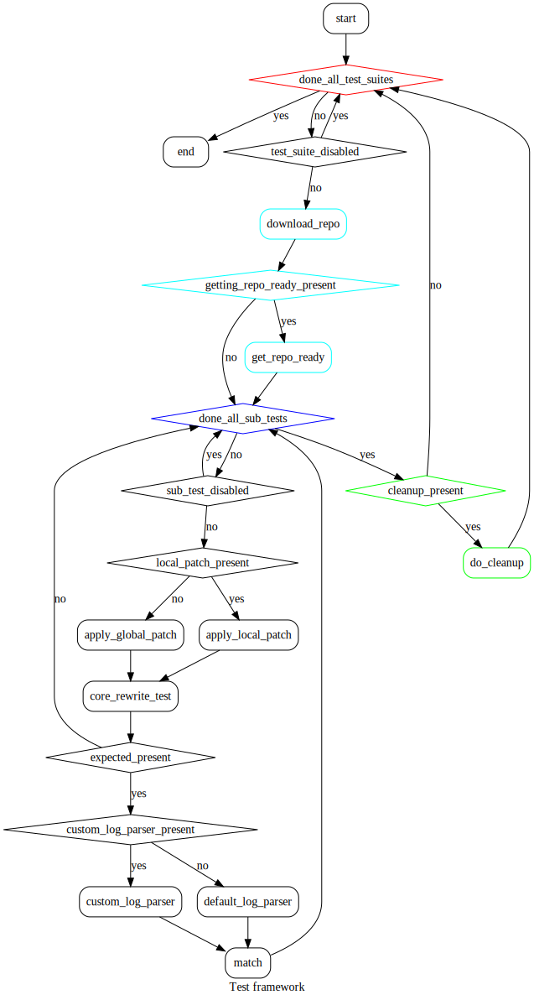
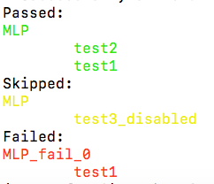
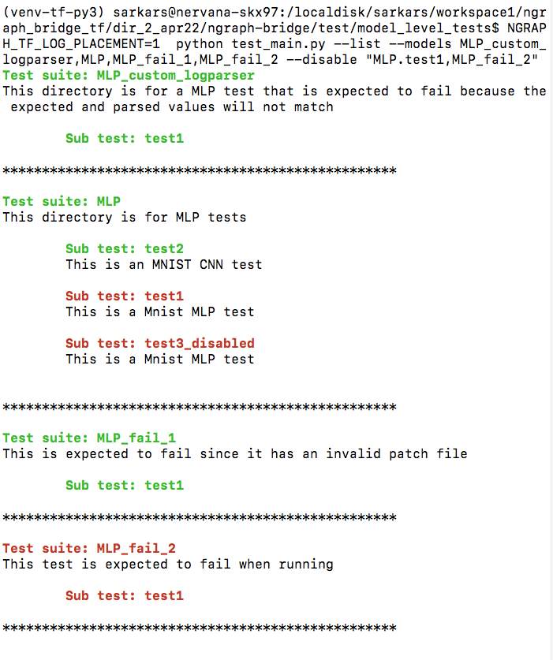

# Model Level Testing for nGraph Bridge

## Introduction
This test framework allows us to download a repo, run multiple tests by applying different patches on the it and then verifying the results obtained. "Results" here can be interpreted as output of `NGRAPH_TF_LOG_PLACEMENT=1` logs or custom results that are generated by the prints that the patch introduced that are then parsed by a custom parser.

### Directory Structure
This section describes the directory structure. Indentation means sub-directories. Top to bottom, roughly, they are in the order in which they are executed
1. `test_main.py`: The CLI to trigger different tests.
2. `models`: The directory containing all test suites.
    1. `Test suite` or `Model test directory` (*Repeated*): A directory in `models`. Each `test suite` represents an external repo that must be downloaded. Usually that corresponds to a particular network topology (but certain repos might run multiple topologies).
        1. `README.md` (*Optional*): Information about this `test suite`. Expected to be short as this text is used by `test_main.py` to print a short help on available tests.
        2. `repo.txt`: Clonable git URL in the first line, optional branch/SHA/tag in the second line (by default master will be used).
        3. `getting_repo_ready.sh` (*Optional*): An executable shell script to run before the tests start running for this repo. Can be used to install prerequisites.
        4. `enable_ngraph.patch` (*Optional*): A patch to be applied to the downloaded repo (**2.1.2**). If this file exists it is used by all `sub-test` directories (**2.1.5**), unless overridden by their own patch file (**2.1.5.1**). Either a global or a local patch file must be present.
        5. `Sub-test` (*Repeated*): Should start with the string `test`. Can be disabled by adding the string `disabled` to its name.
            1. `enable_ngraph.patch` (*Optional*): If a `sub-test` contains its own patch, that takes precedence over the global patch (**2.1.4**)
            2. `core_run_test.sh`: The main run script for this `sub-test`.
            3. `expected.json` (*Optional*): A json file containing expected results. See **Expected results format**. and `--print_parsed` flag
            4. `custom_log_parser.py` (*Optional*): See **Terminology 3** and **Terminology 3.1**.
            5. `README.md` (*Optional*): Information about this `sub-test`. Expected to be short as this text is used by `--list`.
        6. `cleanup.sh` (*Optional*): An executable shell script that will be used to clean up, potentially the effects of `getting_repo_ready.sh` (**2.1.3**)
    2. `Non-repo based Test Suite` (*Repeated*): `Test suites` can also be based on `pb`, `pbtxt` or `savedmodel` instead of being based on a repo
        1. ~~`repo.txt`~~: A non repo based `test suite` should **not** contain a `repo.txt`.
        2. ~~`getting_repo_ready.sh`~~: It should **not** contain `getting_repo_ready.sh`.
        3. ~~`enable_ngraph.patch`~~: Neither can it have a patch file.
        4. `README.md` (*Optional*): It might have a `README`. Same description as **2.1.1**.
        5. `Sub-test` (*Repeated*):
            1. `pbtxt/pb/savedmodel`: One TF model file per `sub-test`.
            2. `expected.json` (*Optional*): A json file containing expected results. See **Expected results format**.

### Terminology:
1. `test suite` or `model test directory`:
    1. `repo based`: See **Directory Structure 2.1**.
    2. `non-repo based`: See **Directory Structure 2.2**.
2. `sub-test`: See **Directory Structure 2.1.5, 2.2.5**.
3. `patch file`: To enable ngraph, make the tests short enoough to run, to add prints etc. Can be global (to a `test-suite`) or local to each `sub-test`. See **Directory Structure 2.1.4, 2.1.5.1**.
4. `log parser`: A default log parsing function `parse_logs` that parses the output of `NGRAPH_TF_LOG_PLACEMENT=1` is present in `tools/log_parser.py`.
    1. `custom log parser`: A python file named `custom_log_parser.py` that contains a function named `custom_parse_logs`. This can be placed in a `sub-test` directory if required. If a custom parser is present, tests are not run with any flags such as `NGRAPH_TF_LOG_PLACEMENT=1` and it is up to the user to use such flags in `core_rewrite_test.sh` if they need it. The patch file (**Directory Structure 2.1.4, 2.1.5.1**) which can modify the repo by adding prints, and the `custom log parser`, the user can write tests that check accuracy/throughput and other metrics.
5. `configuration`: **_TODO_**

### Expected results format
Expected results are specified in a json file of the following format:
1. `configuration` (*Repeated*, *Optional*): Perhaps changing the ngraph backend means different expected results. Generally the `default` configuration is used
    1. `logparse` (*Optional*): Results of parsing `NGRAPH_TF_LOG_PLACEMENT=1` with the default `log parser` in the normal case, or parsing the (user-generated) logs with the `custom log parser`.
        1. `graph id` (*Repeated*, *Optional*): Integers
            1. `num_nodes_in_graph` (*Optional*)
            2. `num_nodes_marked_for_clustering` (*Optional*)
            3. `num_ng_clusters` (*Optional*)
            4. to be expanded as the default `log parser` produces more information.
    2. `time` (*Optional*): Time in seconds.

Note that you can get the expected json file when you are adding a new model by simply passing `--print_parsed` to the test run. This will print a json on screen, which can be copy pasted to the newly made `expected.json` file of that model

## Features and sample uses

1. **Running model(s)**: For example if you run `python test_main.py --run_basic_tests --models MLP,MLP_fail_0`, you can specify which models to run using the `--models` flag. The argument to `--models` is a comma separated list (if it has >1 items). If `--models` is not passed then all the test suites are run. The final output is displayed as passed, skipped or failed tests as shown in the image below. 

2. **Disabling test suites or sub-tests**: Using the `--disable` flag you can disable whole test suites or certain subtests of certain test suites. For example: `--disable "MLP.test1,MLP_fail_2"` would disable test suite `MLP_fail_2` and sub-test `MLP.test1` (but it would run other tests in `MLP` test suite). Sub tests can also be disabled if their directory name has `disabled` in it, for example `MLP/test3_disabled`
3. **Listing tests**: Adding `--list` will produce a list of available tests. It can be coupled with the `--models` and `--disable` flag to get a list of tests that will be run if `--list` is not present. For example the command `python test_main.py --run_basic_tests --models MLP_custom_logparser,MLP,MLP_fail_1,MLP_fail_2 --list --disable "MLP.test1,MLP_fail_2"` prints the following. 

4. **Testing if a model runs**: If `expected.json` is not present just running the test to completion is considered a pass
5. **Testing if model ran with appropriate placement**: If an `expected.json` is present in the sub-test folder then the output of the test is parsed and matched. So model must run and outputs must match expected values
6. **Checking for accuracy**: Lets say we want to train a simple model for 100 iterations and match accuracy after 10 steps. We can do that using the framework by adding appropriate print lines in the patch file and then adding a `custom_log_parser.py` file and `expected.json`, that would parse the log for accuracy prints. A trivial example with a custom parser is `MLP_custom_logparser`
7. **Shell script**: At the end of each run a shell script `dump.sh` is generated that is a shell script of commands that were run. It can be run on the terminal to simulate what `test_main.py` just ran. This might be useful when adding a new test-suite in case we face errors.
8. **Global vs local patching**: Each test suite can have a global patch that all subtests share, or each test can have its own patch file. Local patch file has more precedence than global patch file.
9. **Same repo different commits**: Right now you have to create 2 separate test suites in this case. Checkout `tfmodels` and `tfmodels1`, both of which use the same repo, but different commits, hence they are different test suites.
10. **Configuration**: **_TODO_**

# Currently available tests
On CPU:

| Model | Normal | Grappler | training | inference | repo/test-suite
| --- | --- | --- | --- | --- | ---
| MNIST MLP | :heavy_check_mark: | :heavy_check_mark: | :heavy_check_mark: | :heavy_multiplication_x: | keras
| MNIST CNN | :heavy_check_mark: | :heavy_check_mark: | :heavy_check_mark: | :heavy_multiplication_x: | keras
| resnet20 | :heavy_check_mark: | :heavy_multiplication_x: | :heavy_check_mark: | :heavy_multiplication_x: | tfmodels
| resnet50 | :heavy_check_mark: | :heavy_check_mark: | :heavy_check_mark: | :heavy_multiplication_x: | benchmarks
| densenet | :heavy_check_mark: | :heavy_multiplication_x: | :heavy_check_mark: |  :heavy_multiplication_x: | benchmarks
| mobilenet | :heavy_check_mark: | :heavy_multiplication_x: | :heavy_check_mark: |  :heavy_multiplication_x: | benchmarks
| inceptionv4 | :heavy_check_mark: | :heavy_multiplication_x: | :heavy_check_mark: |  :heavy_multiplication_x: | benchmarks
| a3c | :heavy_check_mark: | :heavy_multiplication_x: | :heavy_multiplication_x: | :heavy_check_mark: | ngraph-models
| dcgan | :heavy_check_mark: | :heavy_multiplication_x: | :heavy_multiplication_x: | :heavy_check_mark: | ngraph-models
| unet | ?? | :heavy_multiplication_x: | ?? | :heavy_check_mark: | unet
| ssd mobilenet v1 | ?? | :heavy_multiplication_x: | ?? | ?? | tfmodels
| nmt |  :heavy_check_mark: | :heavy_multiplication_x: |  :heavy_check_mark: | :heavy_multiplication_x: | nmt
| bert |  :heavy_check_mark: | :heavy_multiplication_x: |  :heavy_check_mark: | :heavy_multiplication_x: | bert
| minigo |  :heavy_check_mark: | :heavy_multiplication_x: |  :heavy_check_mark: | :heavy_multiplication_x: | minigo
| transformer-lt |  :heavy_check_mark: | :heavy_multiplication_x: |  :heavy_multiplication_x: | :heavy_multiplication_x: | tfmodels

On Interpreter:

| Model | Normal | Grappler | training | inference | repo/test-suite
| --- | --- | --- | --- | --- | ---
| MNIST MLP | :heavy_check_mark: | :heavy_multiplication_x: | :heavy_check_mark: | :heavy_multiplication_x: | keras
| MNIST CNN | :heavy_check_mark: | :heavy_multiplication_x: | :heavy_check_mark: | :heavy_multiplication_x: | keras

## TODO
1. **pb/pbtxt/savedmodel based test**
2. **verify_model integration**
3. **compare times: ngtf vs tf**
4. **a common cleanup scenario is pip install X, and then when exiting restoring pip to that state**
5. **Maybe run the tests in their own virtual env sandbox? the user provides the tf and ngraph-bridge whl path**